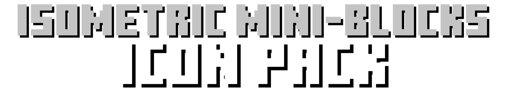
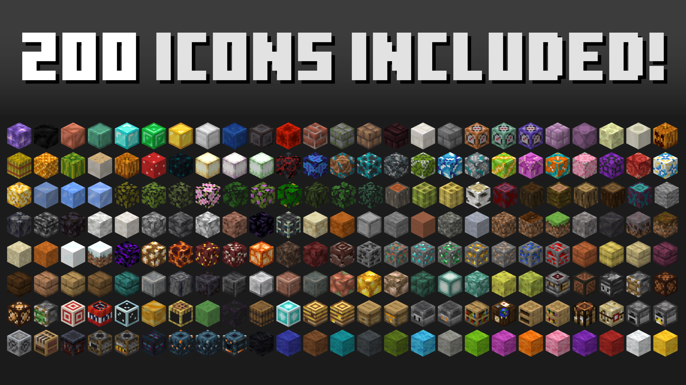

  

A charming collection of isometric block icons created with the textures from the F8thful texture pack. Perfect for enhancing your Minecraft launcher experience or adding some unique customization to your creative projects.

---

## 🖼️ Icons Preview

## 🚀 Getting Started

1. Head to the latest release
2. Choose a desired desired resolution
3. Download the desired resolution pack
4. Store the folder in a safe place 
> You can now reference the icons in supported Minecraft launchers or any other project!

## 📒 Credit

- F8thful https://www.curseforge.com/minecraft/texture-packs/f8thful  
by: [Ewan Howell](https://legacy.curseforge.com/members/ewanhowell5195/projects) - The original artist behind the lovely textures used to make these icons

---

Made with ❤️ by 7eventy7

